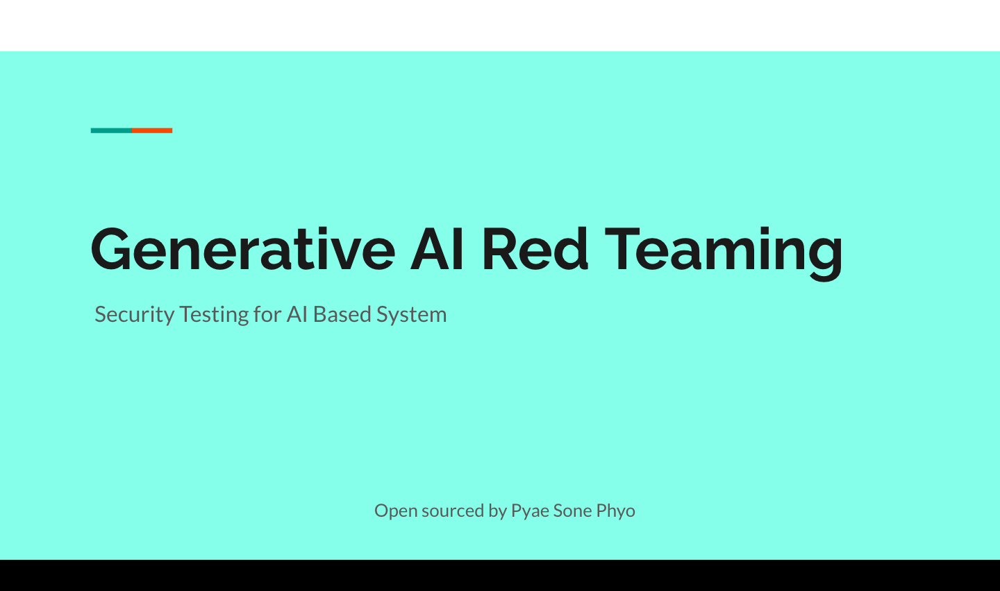

# Generative AI Red Teaming Theory

Welcome to the **Generative AI Red Teaming Theory** repository! This repository contains information, presentations, and resources related to the integration of generative AI in red teaming practices within cybersecurity.

## Table of Contents
- [Overview](#overview)
- [Presentation Slides](#presentation-slides)
- [Key Concepts](#key-concepts)
- [References](#references)
- [Contributing](#contributing)

## Overview
Generative AI Red Teaming combines traditional red teaming methodologies with advanced generative AI techniques to enhance the simulation of cyberattacks, identify vulnerabilities, and improve security measures.

## Presentation Slides
You can view and download the presentation slides here:
[Generative AI Red Teaming Presentation](https://docs.google.com/presentation/d/1_U-vSmGdSrmqJnpz0n7hLDdDadT4KqDtKkAd3wRcnek/edit?usp=sharing)

## Key Concepts
- **Generative Red Teaming**: An approach that utilizes AI to simulate sophisticated attacks.
- **Adversarial Machine Learning**: Techniques used to test the robustness of AI models against adversarial attacks.
- **Attack Simulations**: Use of AI to create automated and realistic attack scenarios.

## References
1. **Adversarial Robustness Toolbox (ART)**  
   Adi, Y., Schwartz, R., Malkin, T., & Shalev-Shwartz, S. (2018). *Towards Evaluating the Robustness of Neural Networks*. [GitHub Repository](https://github.com/Trusted-AI/adversarial-robustness-toolbox).
   
2. **Cybersecurity Frameworks and Methodologies**  
   NIST (National Institute of Standards and Technology). (2018). *Framework for Improving Critical Infrastructure Cybersecurity*. [NIST Framework](https://www.nist.gov/cyberframework).
   

## Contributing
Contributions are welcome! If you have suggestions for improvements or additional resources, please feel free to submit a pull request or open an issue.

---
